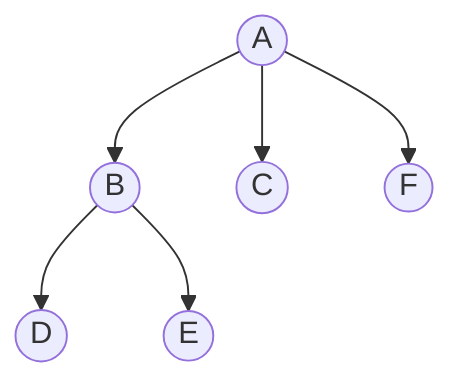
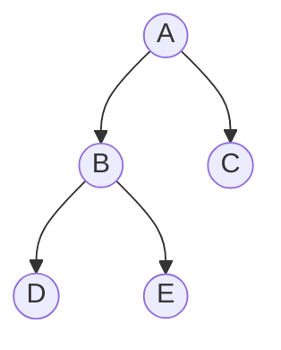
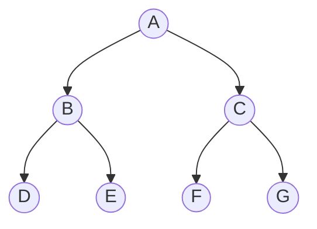

# 树结构

## 一、树形结果特点

- 树形结构只有一个根节点
- 树形结构没有回路

形成回路的是图，树其实就是图的一种，树的学名叫做`有向无环图`。





相关概念：

- 根节点：A（最开始的节点，最上面的节点）
- 叶子节点：下面没有其他节点了（C,F,D,E）
- 节点：既不是根节点，又不是叶子节点的普通节点
- 树的度：这棵树有最多分叉的节点有多少个分叉，这棵树的度就为多少（A分叉有三个，最多，这棵树的度就为3）
- 树的深度：树最深有几层，树的深度就为多少（这棵树的深度就为3）

## 二、二叉树

树的度最多为2的树形结构。


1. 二叉树的根节点（A）
2. 子节点：某个节点下面的节点
3. 父节点：上级节点
4. 叶子节点：CDE
5. 节点：B

### 2.1 满二叉树

概念：

- 所有的叶子节点都在最底层
- 每个非叶子节点都有两个子节点



### 2.2 完全二叉树

- 国内定义：
    - 叶子节点都在最后一层或者倒数第二层
    - 叶子节点都向左聚拢
- 国际定义：
    - 叶子节点都在最后一层或者倒数二层
    - 如果有叶子节点，就必然有两个叶子节点

 ```mermaid
 graph TB
 
 A((A)) --> B((B))
 A((A)) --> C((C))
 B((B)) --> D((D))
 B((B)) --> E((E))
 C((C)) --> F((F))
 ```

如果F节点向左聚拢，则复合国内的完全二叉树定义，但是子啊国际定义中，无论F向哪一边聚拢，他都不是完全二叉树。

### 2.3 子树

在二叉树中，每个节点都认为自己是根节点。

概念：

二叉树中，每一个节点或者叶子节点都是一颗子树的根节点。

左子树，右子树：(B及其子节点是A的左子树，C及其子节点是A的右子树)


### 2.4 二叉树的遍历

- 前序遍历：（先根次序遍历）
    - 先打印当前的，再打印左边的，再打印右边的。
- 中序遍历：（中根次序遍历）
    - 先打印左边的，再打印当前的，再打印右边的。
- 后序遍历：（后根次序遍历）
    - 先打印左边的，再打印右边的，再打印当前的。


例子：

前序遍历：ABDECFG

中序遍历：DBEAFCG

后序遍历：DEBFGCA

### 2.5 二叉树的搜索

搜索分为两种：

- 深度优先搜索：更适合探索未知
- 广度优先搜索：更适合探索局域范围


寻找E是否在树中？

对于深度优先: A -> B -> D -> E

对于广度优先: A -> B -> C -> D -> E

